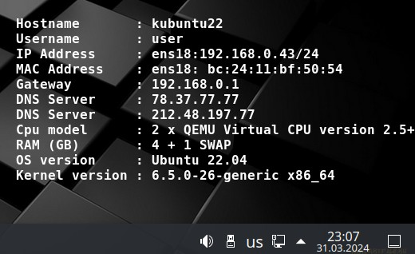
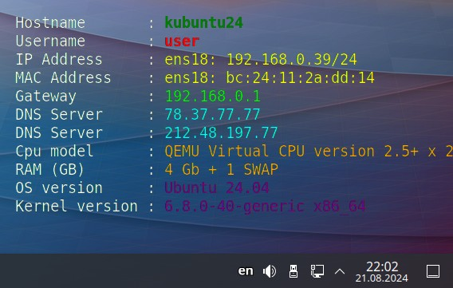

## BGinfo for Linux




* This script require 'Image Magick'. Install it before start lbginfo.sh
* Run lbginfo.sh from ordinary user, not root
* Tested on Kubuntu 22.04/24.04 (Dual display), Alt Linux 10 (KDE, MATE), Astra Linux 1.7 (FLY)
* Recommended to set DEFAULTWALLPAPER=/usr/share/WallPapers/default.jpg. Where place default.jpg image.

#### Fix Error: attempt to perform an operation not allowed by the security policy `@-'
```
Edit file /etc/ImageMagick-6/policy.xml
Comment this:
<!-- <policy domain="path" rights="none" pattern="@*"/> -->
```


### Usage:
```
Launch lbginfo.sh without the option, then it will just update the current wallpaper

-r    Resize image to primary display resolution
lbginfo.sh -r

-f    Use custom file (Do not mix [-f] and [-d] options)
lbginfo.sh -f /some/file.jpg

-d    Use custom directory (Do not mix [-f] and [-d] options)
lbginfo.sh -d /some/dir

In /some/dir you may place files like:
1024x768.jpg
1280x1024.jpg
1366x768.jpg
1600x1200.jpg
1920x1080.jpg
etc...
Script will use file which match primary display resolution
Example folder: /usr/share/WallPapers/custom1
Example folder: /usr/share/WallPapers/NewYear

-p    Use pango extension
```

### Customization:
```
# Language: RU, EN
BGLANG="RU"
# Position SystemInfo: Center, East, North, NorthEast, Northwest, South, SouthEast, SouthWest, West
POSITION="SouthEast"
# Some monospace fonts: Courier-Bold, CourierNew, Ubuntu Mono Bold, DejaVu Sans Mono, FreeMono Bold
FONT="DejaVu-Sans-Mono-Bold"
FONT_P="DejaVu Sans Mono"  # For Pango
# Text/font size
FONTSIZE="16"
FONTSIZE_P="14" # For Pango
# Text color: White, Black, Red, Green, Blue, Yellow, Orange ...
FILL="White"
# Background color: none, White, Black, Red, Green, Blue, Yellow, Orange ...
BFILL="none"
STROKEWIDTH="0"
STROKECOLOR="none"
```
